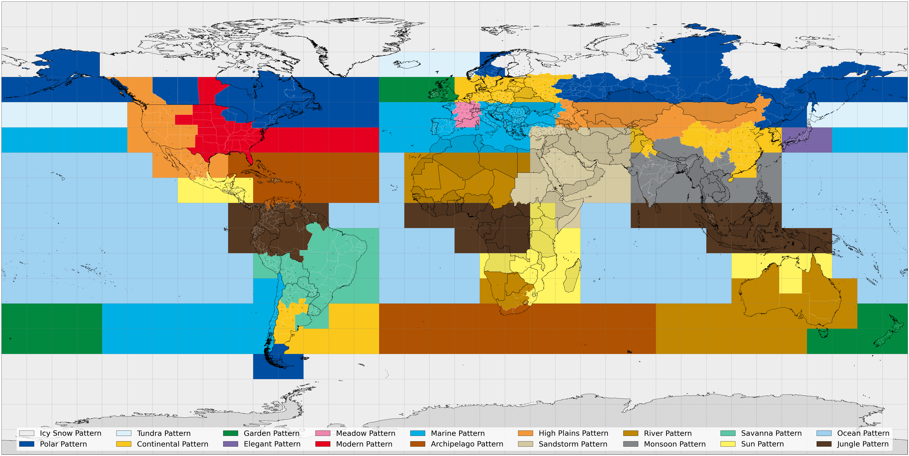
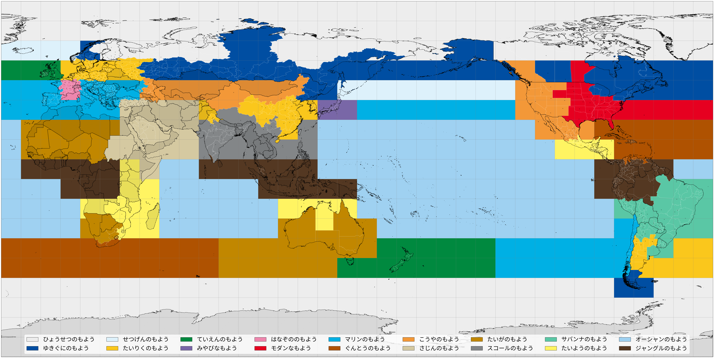

([日本語](pregenerated/0/map_ja_0.png)
| [English](pregenerated/0/map_en_0.png)
| [Deutsch](pregenerated/0/map_de_0.png)
| [Français](pregenerated/0/map_fr_0.png)
| [Italiano](pregenerated/0/map_it_0.png)
| [Español](pregenerated/0/map_es_0.png)
| [한국어](pregenerated/0/map_ko_0.png)
| [繁體中文](pregenerated/0/map_zh-Hant_0.png)
| [简体中文](pregenerated/0/map_zh-Hans_0.png))


([日本語](pregenerated/150/map_ja_150.png)
| [English](pregenerated/150/map_en_150.png)
| [Deutsch](pregenerated/150/map_de_150.png)
| [Français](pregenerated/150/map_fr_150.png)
| [Italiano](pregenerated/150/map_it_150.png)
| [Español](pregenerated/150/map_es_150.png)
| [한국어](pregenerated/150/map_ko_150.png)
| [繁體中文](pregenerated/150/map_zh-Hant_150.png)
| [简体中文](pregenerated/150/map_zh-Hans_150.png))

---

An [equirectangular projection](https://en.wikipedia.org/wiki/Equirectangular_projection) map of the possible countries/regions corresponding to each [Vivillon](https://bulbapedia.bulbagarden.net/wiki/Vivillon_(Pokémon)) form.
The dots indicate the latitude/longitude coordinates associated with each country/region in the Nintendo 3DS system software.
Hatched countries/regions cannot be selected on a Nintendo 3DS system from any region.

Map data for all countries except for France is from the [GADM database](https://gadm.org/data.html), version 4.1.
Map data of France is from the GADM database, version 2.8.
The data can be used for [non-commercial purposes](https://gadm.org/license.html) only.
Data for Austria is licensed under the [CC BY-SA 2.0](https://creativecommons.org/licenses/by-sa/2.0/) license.

The following country-level divisions in the GADM database are treated differently by the Nintendo 3DS system software:
* [Greenland](https://en.wikipedia.org/wiki/Greenland) (considered a region of the [Kingdom of Denmark](https://en.wikipedia.org/wiki/Denmark))
* [Ahvenanmaa / Åland](https://en.wikipedia.org/wiki/Åland) (considered a region of [Finland](https://en.wikipedia.org/wiki/Finland))
* [French Guiana](https://en.wikipedia.org/wiki/French_Guiana), [Guadeloupe](https://en.wikipedia.org/wiki/Guadeloupe), [Martinique](https://en.wikipedia.org/wiki/Martinique), and [Réunion](https://en.wikipedia.org/wiki/Réunion) (considered regions of [France](https://en.wikipedia.org/wiki/France))
* [Curaçao](https://en.wikipedia.org/wiki/Curaçao) (included as part of the [Netherlands Antilles](https://en.wikipedia.org/wiki/Netherlands_Antilles), which dissolved in 2010)
* [Sint Maarten](https://en.wikipedia.org/wiki/Sint_Maarten) (included as part of the Netherlands Antilles, which dissolved in 2010)
* [Bonaire](https://en.wikipedia.org/wiki/Bonaire), [Sint Eustatius](https://en.wikipedia.org/wiki/Sint_Eustatius), and [Saba](https://en.wikipedia.org/wiki/Saba) (included as part of the Netherlands Antilles, which dissolved in 2010)
* [Svalbard and Jan Mayen](https://en.wikipedia.org/wiki/Svalbard_and_Jan_Mayen) (considered a region of [Norway](https://en.wikipedia.org/wiki/Norway) as "Svalbard")
* [Serbia](https://en.wikipedia.org/wiki/Serbia) and [Kosovo](https://en.wikipedia.org/wiki/Kosovo) (combined into "Serbia and Kosovo")
* [Puerto Rico](https://en.wikipedia.org/wiki/Puerto_Rico) (considered a region of the [United States](https://en.wikipedia.org/wiki/United_States))

The following modifications to the subdivision data need to be made to match the Nintendo 3DS system software:
* [France](https://en.wikipedia.org/wiki/France): Use the [regions](https://en.wikipedia.org/wiki/Regions_of_France) prior to 2015
* [Trinidad and Tobago](https://en.wikipedia.org/wiki/Trinidad_and_Tobago): Use the [historic counties](https://en.wikipedia.org/wiki/Counties_of_Trinidad_and_Tobago) prior to the early 1990s
* [Spain](https://en.wikipedia.org/wiki/Spain): Separate "Ceuta and Melilla" into [Ceuta](https://en.wikipedia.org/wiki/Ceuta) and [Melilla](https://en.wikipedia.org/wiki/Melilla)
* [China](https://en.wikipedia.org/wiki/China): Treat [Hong Kong](https://en.wikipedia.org/wiki/Hong_Kong) and [Macao](https://en.wikipedia.org/wiki/Macau) as country-level divisions

The following subdivisions in the GADM database are not used by the Nintendo 3DS system software:
* [Antigua and Barbuda](https://en.wikipedia.org/wiki/Antigua_and_Barbuda): [Redonda](https://en.wikipedia.org/wiki/Redonda) (annexed by [Saint John](https://en.wikipedia.org/wiki/Saint_John_Parish,_Antigua_and_Barbuda) in 1872)
* [Chile](https://en.wikipedia.org/wiki/Chile): [Arica y Parinacota](https://en.wikipedia.org/wiki/Arica_y_Parinacota_Region) (split from [Tarapacá](https://en.wikipedia.org/wiki/Tarapacá_Region) in 2007), [Los Ríos](https://en.wikipedia.org/wiki/Los_Ríos_Region) (split from [Los Lagos](https://en.wikipedia.org/wiki/Los_Lagos_Region) in 2007), and [Ñuble](https://en.wikipedia.org/wiki/Ñuble_Region) (split from [Bío-Bío](https://en.wikipedia.org/wiki/Biobío_Region) in 2017)
* [Dominican Republic](https://en.wikipedia.org/wiki/Dominican_Republic): [San José de Ocoa](https://en.wikipedia.org/wiki/San_José_de_Ocoa_Province) (split from [Peravia](https://en.wikipedia.org/wiki/Peravia_Province) in 2000) and [Santo Domingo](https://en.wikipedia.org/wiki/Santo_Domingo_Province) (split from the [Distrito Nacional](https://en.wikipedia.org/wiki/Distrito_Nacional) in 2001)
* [Greece](https://en.wikipedia.org/wiki/Greece): [Mount Athos](https://en.wikipedia.org/wiki/Monastic_community_of_Mount_Athos) (not included)
* [India](https://en.wikipedia.org/wiki/India): [Arunachal Pradesh](https://en.wikipedia.org/wiki/Arunachal_Pradesh) (not included, likely due to [border dispute with China](https://en.wikipedia.org/wiki/Sino-Indian_border_dispute); India includes an "Other" region instead), [Jammu and Kashmir](https://en.wikipedia.org/wiki/Jammu_and_Kashmir_(state)) (not included, likely due to [border dispute with Pakistan](https://en.wikipedia.org/wiki/India–Pakistan_border) and China; India includes an "Other" region instead), and [Telangana](https://en.wikipedia.org/wiki/Telangana) (split from [Andhra Pradesh](https://en.wikipedia.org/wiki/Andhra_Pradesh) in 2014)
* [Netherlands](https://en.wikipedia.org/wiki/Netherlands): [IJsselmeer](https://en.wikipedia.org/wiki/IJsselmeer) (body of water; borders [Flevoland](https://en.wikipedia.org/wiki/Flevoland), [Friesland](https://en.wikipedia.org/wiki/Friesland), and [North Holland](https://en.wikipedia.org/wiki/North_Holland)) and [Zeeuwse meren](https://en.wikipedia.org/wiki/Delta_Works) (body of water; borders [South Holland](https://en.wikipedia.org/wiki/South_Holland) and [Zeeland](https://en.wikipedia.org/wiki/Zeeland))
* [New Zealand](https://en.wikipedia.org/wiki/New_Zealand): [Chatham Islands](https://en.wikipedia.org/wiki/Chatham_Islands) (not included)
* [Nicaragua](https://en.wikipedia.org/wiki/Nicaragua): [Lake Nicaragua](https://en.wikipedia.org/wiki/Lake_Nicaragua) (body of water; borders [Granada](https://en.wikipedia.org/wiki/Granada_Department), [Rivas](https://en.wikipedia.org/wiki/Rivas_Department), and [Río San Juan](https://en.wikipedia.org/wiki/Río_San_Juan_Department))
* [Panama](https://en.wikipedia.org/wiki/Panama): [Emberá-Wounaan](https://en.wikipedia.org/wiki/Emberá-Wounaan_Comarca) (split from [Darién](https://en.wikipedia.org/wiki/Darién_Province) in 1983), [Ngäbe-Buglé](https://en.wikipedia.org/wiki/Ngäbe-Buglé_Comarca) (split from portions of [Bocas del Toro](https://en.wikipedia.org/wiki/Bocas_del_Toro_Province), [Chiriquí](https://en.wikipedia.org/wiki/Chiriquí_Province), and [Veraguas](https://en.wikipedia.org/wiki/Veraguas_Province) in 1997), and [Panamá Oeste](https://en.wikipedia.org/wiki/Panamá_Oeste_Province) (split from [Panamá](https://en.wikipedia.org/wiki/Panamá_Province) in 2014)
* [Peru](https://en.wikipedia.org/wiki/Peru): [Department of Lima](https://en.wikipedia.org/wiki/Department_of_Lima) (not included; [Lima Province](https://en.wikipedia.org/wiki/Lima_Province) is listed as "Lima")
* [South Korea](https://en.wikipedia.org/wiki/South_Korea): [Sejong](https://en.wikipedia.org/wiki/Sejong_City) (split from [Gyeongsangnam-do](https://en.wikipedia.org/wiki/Gyeongsangnam-do) in 2012)

The Nintendo 3DS system refers to [Tierra del Fuego](https://en.wikipedia.org/wiki/Tierra_del_Fuego_Province,_Argentina) and [Magallanes](https://en.wikipedia.org/wiki/Magallanes_Region) by their official names as "Tierra del Fuego, Antártida e Islas del Atlántico Sur" and "Magallanes y la Antártica Chilena", which would include disputed claims on the [Falkland Islands](https://en.wikipedia.org/wiki/Falkland_Islands), [South Georgia and the South Sandwich Islands](https://en.wikipedia.org/wiki/South_Georgia_and_the_South_Sandwich_Islands), and [Antarctica](https://en.wikipedia.org/wiki/Antarctica).
These claims are not included on the map.

---

To create the maps locally, clone the repository and run the following in the project directory:
```commandline
pip install -r requirements.txt
python make_map.py
```